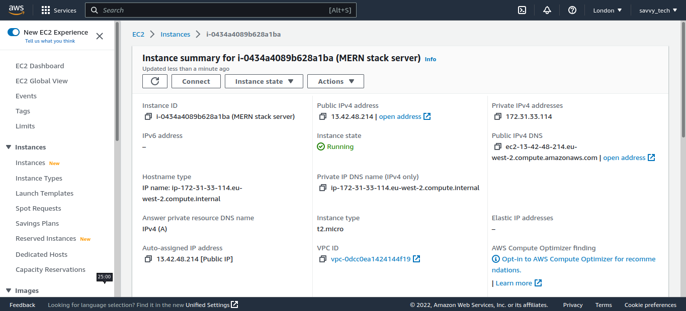
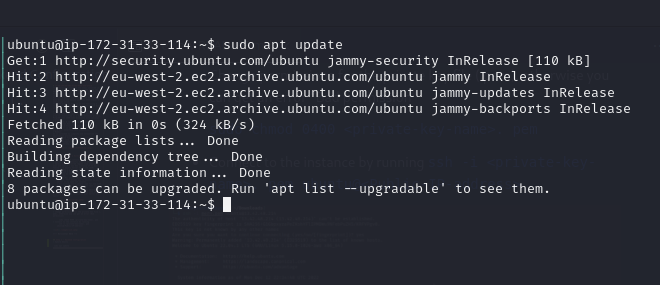
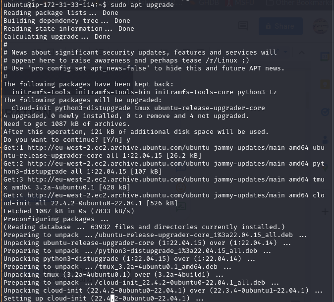
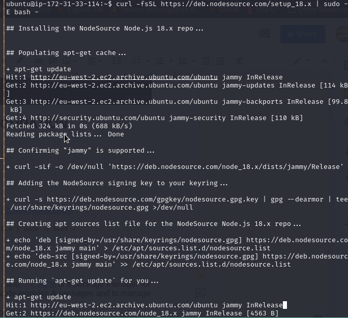
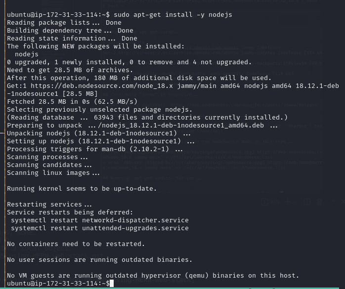
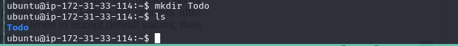
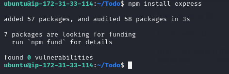
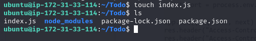
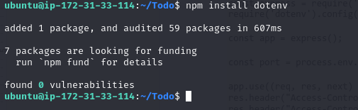
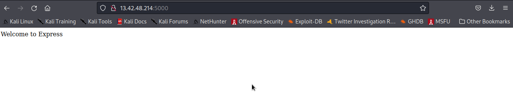

# TO-DO-APP-ON-AWS-USING-MERN-WEB-STACK
This repository explains the steps involved in creating a to-do application on AWS using the MERN web stack. The MERN web stack consists of MongoDB, ExpressJS, ReactJS, and NodeJS as its working components. 
Full-stack online applications can be deployed more quickly and easily with the MERN Stack, a Javascript stack.
The MERN Stack is made up of the following 4 technologies: MongoDB, Express, React, and Node.js.

* Mongo-DB: MongoDB is a source-available cross-platform document-oriented database program. Classified as a NoSQL database program, MongoDB uses JSON-like documents with optional schemas.
* ExpressJS: A server-side Web Application framework for Node.js.
* ReactJS: A frontend framework developed by Facebook. It is based on JavaScript, used to build User Interface (UI) components.
* Nodejs:
It is intended to simplify and streamline the development process.
Each of these four technologies plays a significant role in the creation of web apps and offers developers an end-to-end environment in which to operate. 

---
____
## Step 1 - Create a Virtual Server on AWS
<!-- UL -->
* Login to the AWS console
* Search for EC2 (Elastic Compute Cloud) 
* Select your preferred region (the closest to you) and launch a new EC2 instance of t2.micro family with Ubuntu Server 20.04 LTS (HVM)
* Type a name e.g My_Lamp_Server
 Click create a new key pair, use any name of your choice as the name for the pem file and select .pem.
    * Linux/Mac users, choose .pem for use with openssh. This allows you to connect to your server using open ssh clients.
    * For windows users choose .ppk for use with putty. Putty is a software that lets you connect remotely to servers
* Save your private key (.pem file) securely and do not share it with anyone! If you lose it, you will not be able to connect to your server ever again! 

* On your local computer, open the terminal and change directory to the Downloads folder, type 
    
    `$ cd ~/Downloads` 
* Change permissions for the private key file (.pem), otherwise you can get an error “Bad permission”
    
    ` sudo chmod 0400 <private-key-name>. pem` 
* Connect to the instance by running
    ` ssh -i <private-key-name>. pem ubuntu@<Public-IP-address>`

<!-- Horizontal RUle -->
---
___
## Step 2 - Backend Configuration
* Update Ubuntu

    `sudo apt update`

* Upgrade ubuntu

    `sudo apt upgrade`

* Since we are using Ubuntu as our server, we will get the location of Node.js software from Ubuntu repositories.

    `curl -fsSL https://deb.nodesource.com/setup_18.x | sudo -E bash -`

* Install Node.js with the command below

    `sudo apt-get install -y nodejs`

* Verify the node installation with the command below

`node --version && npm --version` or `node -v && npm -v`

The command above checks the version of node and npm installed. npm is a package manager for node.

* Application Code Setup
Create a new directory for your To-Do project and run the `ls` command to verify that Todo directory is created.

    `mkdir TOdo`

    `ls`

* Now change your current directory to the newly created one:

    `cd Todo`

* Next, you will use the command `npm init` to initialise your project, so that a new file named package.json will be created. This file will  contain information about your application and the dependencies that it needs to run.

    `npm init`

    

* Install ExpressJS
Express is a framework for Node.js, so we can install it using the npm package manager

    `npm install express`

    

* Now create an file index.js and type `ls` to check the contents of the directory

    `touch index.js`
    `ls`

    

* Next. Install the dotenv module

    `npm install dotenv`

    

* Open the index.js file in the vim editor and type the code below into it and save.

    `vim index.js`

        const express = require('express');
        require('dotenv').config();
        
        const app = express();
        
        const port = process.env.PORT || 5000;
        
        app.use((req, res, next) => {
        res.header("Access-Control-Allow-Origin", "\*");
        res.header("Access-Control-Allow-Headers", "Origin, X-Requested-With, Content-Type, Accept");
        next();
        });
        
        app.use((req, res, next) => {
        res.send('Welcome to Express');
        });
        
        app.listen(port, () => {
        console.log(`Server running on port ${port}`)
        });

* Now start the server to see if it works. Open your terminal in the same directory as your index.js file and type:

    `node index.js`

* Ensure you have port 5000 opened in EC2 security groups because the application will be running on that port. Also open port 80 for web access.

* Open up your browser and try to access your server’s Public IP or Public DNS name followed by port 5000:

`http://<PublicIP-or-PublicDNS>:5000`

----------

### Routes
There are three actions that our To-Do app should be able to do:

* Create a new task
* Display list of all tasks
* Delete a completed task

Each task will be associated with some particular endpoint and will use different standard HTTP request methods: POST, GET, DELETE.

For each task, we need to create routes that will define various endpoints that the To-do app will depend on. Create a folder routes

